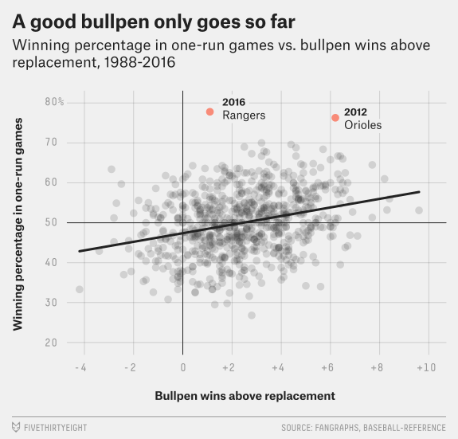
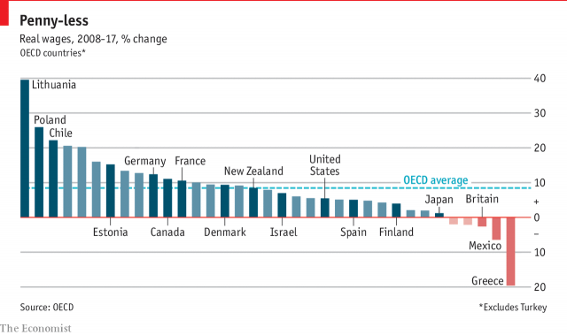
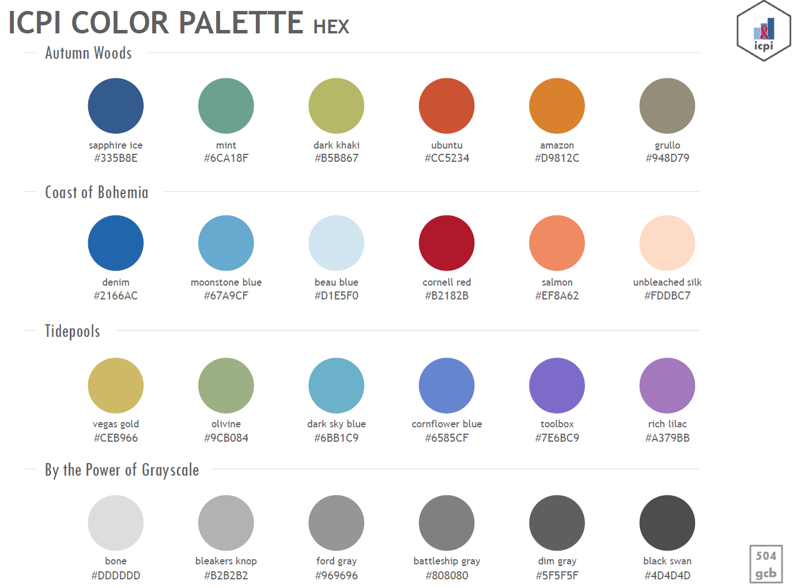
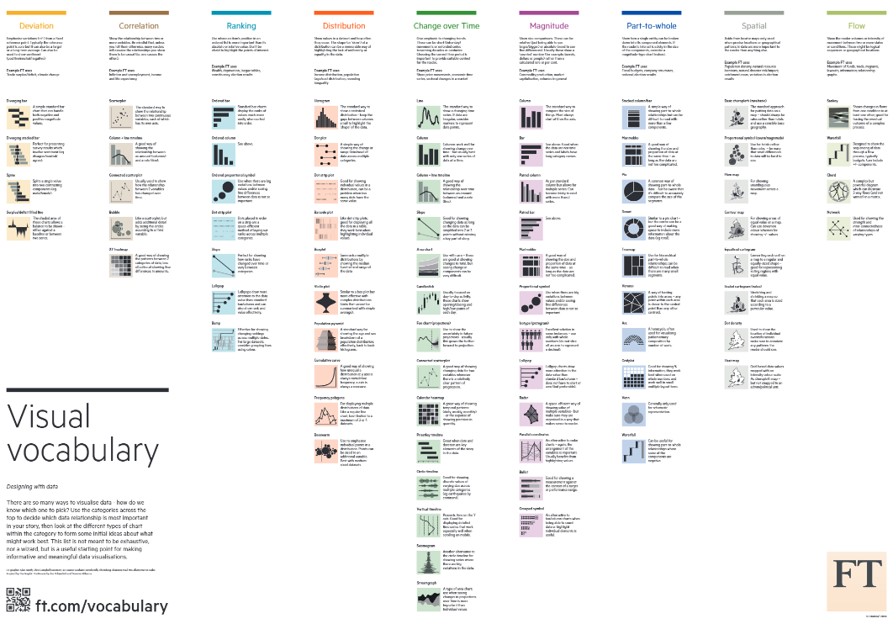
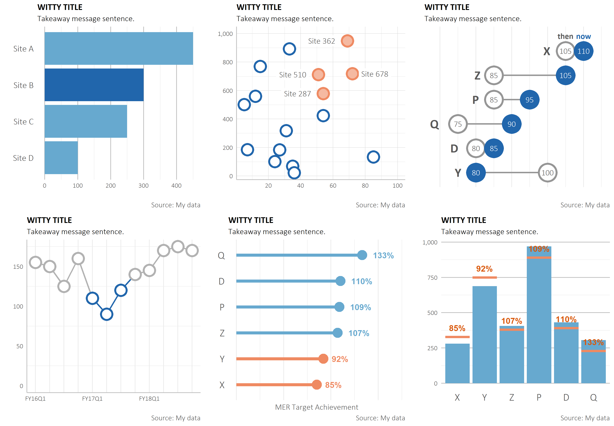

```{r setup, include=FALSE}
knitr::opts_chunk$set(echo = TRUE)
```

### Overview

The main purpose of a style guide is to provide an organization with guide rails on how to present data inline with an overall vision so that all the organization's visuals have a similar look and feel. For example, in the below images, it's easy to pick out which organizations produced these graphics






Each of these graphics fits a particular style that matches the rest of what that organizations produces, whether it be particular font, colors, or layout.

ICPI aims to create a cohesive branding style within PEPFAR to make it clear what products and visuals are produced in our shop. The rest of this Style Guide will layout the aims of our organization. It's important to recognize that what is expounded upon below are best practices and a broader guide, these are not mandatory rules to follow.  

### COLOR

ICPI DIV has put together a number of different colors palettes to use with visualizations.



There are four different palettes, including a gray scale one. The primary colors that should be used are the **first two within each color palette** in the table above; the remainder are secondary colors. While there are multiple options, the preference, in order to boost consistency, would be to use **Autumn Woods**. 

**Gray** should also feature prominently as a **default for background colors**, i.e. axis lines, texts, etc, rather than defaulting to black.

### FONT

Fonts are another important aspect of consistent branding. The default font for ICPI products is a combination of **Calibri** and **Calibri Light**. Titles, bolded text, text that should be emphasized or stand out from a colored background should be Calibri, where subtitles, paragraph text, captions or axis text/numbering should be **Calibri Light**. Titles should be written in all caps.

Size also plays in an an important determinant of emphasis. For graphics, titles should have a size 16 font, subtitles 14, axis labels 12, and captions 9.

Font color is also an important component that adds or detracts focus from you main message. Since the title is a focal point, it's font color should be black. All other text should be primary a lighter gray shade, included axis titles, captions, axis labels, etc. Direct data labels may be black, a light gray, or match the bar/dot/line/etc color depending on its importance or association.

### VISUALS

The primary purpose of this guide is to support the creation of data visualizations. The following sections layout important aspects of visualizing PEPFAR data.

#### Chart Choice

There is a wealth of chat options to choose from. The Financial Times produced a great graphic that depicts what chart types should be used based on the story you're trying to tell with your data. For instance, if you wanted to show how a budget was broken down, that would fall under the "Part to Whole" section and a Tree map might be a good option to pursue. 



Working in PEPFAR, we see a host of different chart types seen in the above graphic: heat maps, ordered bars, dot plots, slope charts, population pyramids, paired bar, line chart, bullet charts, and scatter plots to name a few. We will dive into a number of different element to keep in mind that are applicable regardless of what type you choose.

#### Aesthetics

The first and most important element when we discuss styling is format. 



- **TEXT** - Adding context to your visuals is an extremely important element. This context can come in a number of different forms: title, subtitle, captions, axis labels, legends, and data point labels. All text should use the font laid out in the above section (**see Font**).  
   - Titles - All graphs should have a title that give an overall message about what you, the analyst, are trying to convey. A titles like "GDP by Country" informs the reader that they are looking at GDP, but it would be stronger if you emphasize your message, e.g. "A wide gap exists between the leading economies and the others." **Titles should be written in all upper case.**
   - Subtitle - You can and should convey additional information in the subtitle which should be a full sentence describing what is going on. 
   - Axis labels - Axis label can be excluded where the contents are obvious or included in the title or subtitle. For instance, a line chart with years on the x axis does not need a x axis label of "Year".
   - Caption - Information such as sources or notes about calculations should be included in the visual. This font can be 
   - Legend - **see LEGENDS**

- **COLOR** - Another important feature of this graph is that it uses colors strategically. Rather than color all the bars the same or paint a rainbow with them, the graph above uses a dark color for Site B to highlight it and draw emphasis. Use color sparingly; it should be used to convey a message.

- **GRIDLINES** - Grid lines often get lumped into the chart junk category, i.e. they detract from the purpose of the graph. Grid lines can help where strategically added, like making it easier to read. Grid lines should be made a light shade of gray and used sparingly.

- **TICK MARKS AND AXIS LINES** - Tick marks are a feature often included by default, but do not serve a purpose and fall into the chart junk category. They should be excluded from your graphics. Axis line are not always necessary and can be included in your visuals; they should be shaded a light gray to keep them from "popping" or being distracting. 

- **AXIS TITLES AND LABELS** - Axis titles should be short and to the point so as to convey the relevant information and not detract from the overall visual. It is important to think about your axis labels. They should be minimal as well. Often however, axis labels can be a bit longer than the allotted space on the axis and visual software automatically reorients them diagonally to fit them. Diagonal text makes it more difficult for the audience to read and should be avoided. An easy solution is to flip the orientation of your chart so the long text is on the y axis rather than the x axis. 

- **NUMBER FORMATS** - Number formatting can be easily overlooked. Where numbers spill over into the thousands or millions, commas should be added to make it easier to read. Percentages can either have the percent symbol or have it included in the title/subtitle/axis label. Percentages should not be listed as decimals, eg .49 should be written as 49%. Where possible, you should reduce clutter by rounding numbers. This applies to decimals (there is often false precision using decimals and they crowd up the display) as well as to large numbers, eg 2,000,000 could be shortened to 2m or 2M.

- **LEGENDS** - It is important for readers to know what the colors used in a graph related to. However, included a legend off to the side can make it more difficult for the read as they have to flip back and forth between the graph and legend and they can take up a lot of valuable real estate. Instead, the analyst should direct labeling where possible or should integrate the legend into the graph title/subtitle.

- **ORDERING** - The default ordering for graphs often is alphabetical, which should be avoided. Graphs should be ordered strategically. For instance you may want to order on a particular category or value. This effort helps convey a focus and underlying purpose of the graph.

- **3D** - Visual graphs should be kept to 2D. There is nothing added with the extra dimension and should be completely avoided. They fall into squarely into the chart junk category.

- **DUAL AXIS** - Dual axis charts should be avoided since they are both difficult to read and interpret for a reader. A major issue with these charts is that the intersection points of the two graphs (eg where dots exceed bar height) can be conflated as meaningful. These graphs can also be difficult to read when poorly labeled (eg its not clear which axis applies to which chart element). An improvement to this layout is instead to graph the data on separate plots and align them next to one another. 

- **LABELING** - Labeling is an important element to highlight importance and should be used sparingly. There are different types of labels/uses: (1) direct labeling instead of using a legend; (2) value labels, e.g. noting the length/value of a bar; or (3) character labels, e.g. labeling a site name. For example, rather than label all sites names on a scatter plot, just use labeling to call out points of interest. If, however, you are labeling all the values for a bar chart, it important to not also use your axis labeling as this would be repetitive and only serve as chart junk, just distracting rather than adding anything to the visual.

- **ELEMENT SIZE** - In addition to color, element and text size (and bolding) can be used for emphasis to draw the reader to the data you want them to see. Adjusting the size compared to the other data elements will emphasize that point or value compared to the others.

- **ELEMENT SPACING** - When visualizing data, its important to consider the use of white space, ie how much space doesn't have ink on it. It is important not to overload your audience with too much information and give the graph room to breathe. However, too much white space can be detracting. For instance, default bar spacing Excel can leave too much room between bars and the analyst should reduce this so the gap width is no more than 50%.