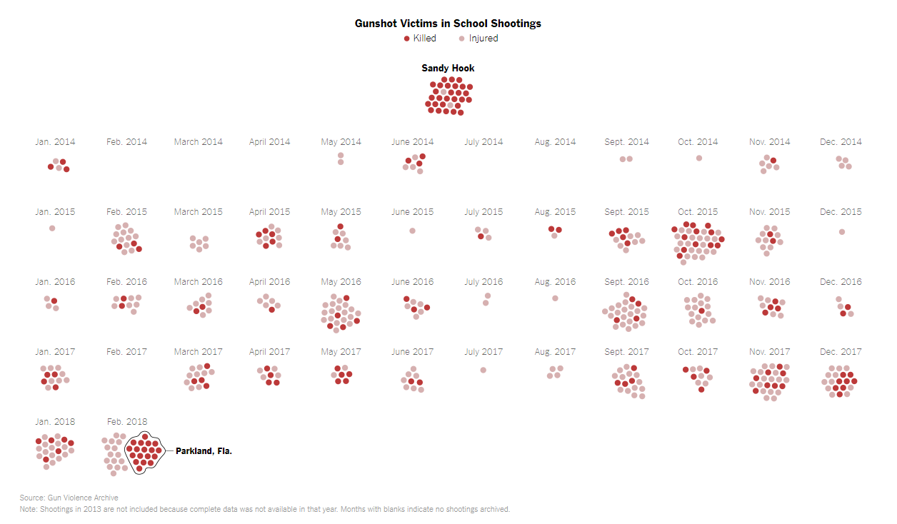
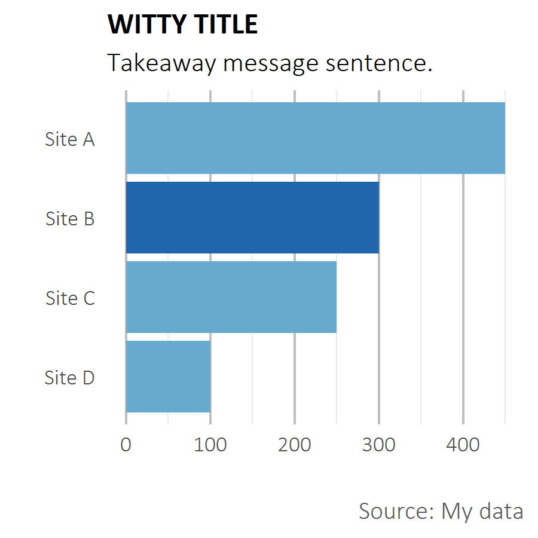

```{r setup, include=FALSE}
knitr::opts_chunk$set(echo = TRUE)
```

### Overview

The main purpose of a style guide is to provide an organization with guide rails on how to present data inline with an overall vision so that all the organization's visuals have a similar look and feel. For example, in the below images, it's easy to pick out which organizations produced these graphics





Each of these graphics fits a particular style that matches the rest of what that organizations produces, whether it be particular font, colors, or layout.

ICPI aims to create a cohesive branding style within PEPFAR to make it clear what products and visuals are produced in our shop. The rest of this Style Guide will layout the aims of our orgnazation. It's important to recognize that what is expounded upon below are best pratices and a broader guide, these are not manditory rules to follow.  

### COLOR

ICPI DIV has put together a number of different colors pallettes to use with visualizations.


There are four different palettes, including a grascale one. The primary colors that should be used are the **first two within each color palette** in the table above; the remainer are secondary colors. While there are multiple options, the preference, in order to boost consistency, would be to use **Autumn Woods**. 

**Gray** should also feature prominently as a **default for background colors**, i.e. axis lines, texts, etc, rather than defaulting to black.

### FONT

Fonts are another important aspect of consistent branding. The default font for ICPI products is a combination of **Calibri** and **Calibri Light**. Titles, bolded text, text that should be emphasized or stand out from a colored background should be Calibri, where subtitles, paragraph text, captions or axis text/numbering should be **Calibri Light**

Size also plays in an an important determinant of emphasis. For graphics, titles should have a size 16 font, subtitles 14, axis labels 12, and captions 9.

### VISUALS

The primary purpose of this guide is to support the creation of data visualizations. The following sections layout important aspects of visualizing PEPFAR data.

#### Chart Choice

There is a wealth of chat options to choose from. The Financial Times produced a great graphic that depicits what chart types should be used based on the story you're trying to tell with your data. For instance, if you wanted to show how a budget was broken down, that would fall under the "Part to Whole" section and a Treemap might be a good option to pursue. 


Working in PEPFAR, we see a host of different chart types seen in the above graphic: heat maps, ordered bars, dot plots, slope charts, population pyraminds, paired bar, line chart, bullet charts, and scatter plots to name a few. We will dive into a number of different element to keep in mind that are applicable regardless of what type you choose.

#### Format

The first and most important element when we discuss styling is format. Formating relates to the aesthetics we ascrible to a visual.



Let's start with the composition. The above graph has a title, subtitle, x-axis labels, y axis labels, gridlines, and a caption.

All graphs should have a title that give an overall message about what you, the analyst, are trying to convey. Above titles like "GDP by Country." This title informs the reader that they are looking at GDP, but it would be stronger if you emphasize your message, e.g. "A wide gap exists between the leading sode brand and the others." You can and should convey additional imformation in the subtitle which should be a full sentence describing what is going on. 

Another important feature of this graph is that it uses colors strategically. Rather than color all the bars the same or paint a rainbow with them, the graph above uses a dark color for Site B to highlight it and draw empahsis. 

The visual also makes use of the available spacing. Bars have a decent sized gap between them and the x and y axes only extend as far as neded without having an excess of white space.

Boarder and ticks are removed (often referred to as chart junk as they can be distracting and take empahsis away from your message with the plot) and the gridlines are sublte, colored gray instead of a harsh black.

#### Ordering
#### Dual Axes
#### Labeling