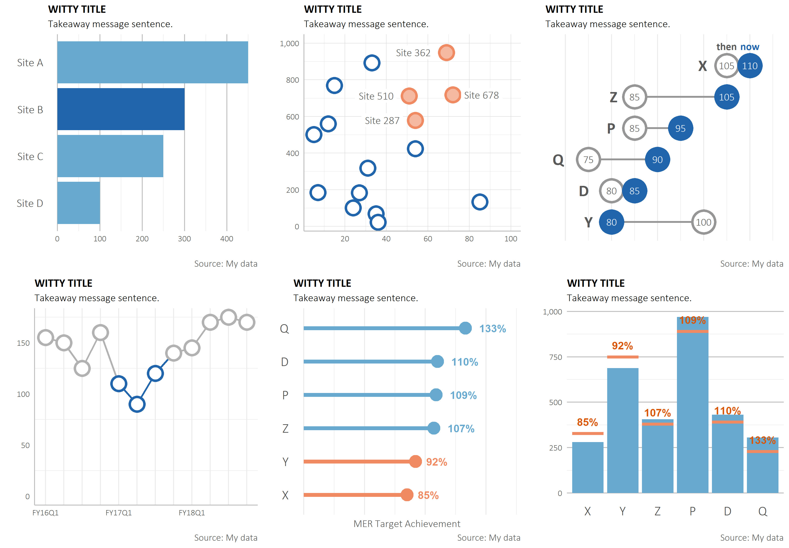
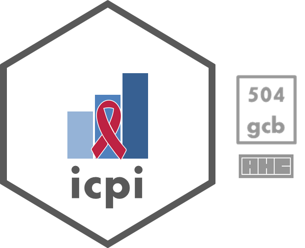

ICPI Style Guide
================
Updated: January 2019

### Overview

The main purpose of a style guide is to provide an organization with
guide rails on how to present data inline with an overall vision so that
all the organization’s visuals have a similar look and feel. For
example, in the below images, it’s easy to pick out which organizations
produced these graphics

Each of these graphics fits a particular style that matches the rest of
what that organizations produces, whether it be particular font, colors,
or layout.

ICPI aims to create a cohesive branding style within PEPFAR to make it
clear what products and visuals are produced in our shop. The rest of
this Style Guide will layout the aims of our organization. It’s
important to recognize that what is expounded upon below are best
practices and a broader guide, these are not mandatory rules to follow.

### COLOR

ICPI DIV has put together a number of different colors palettes to use
with visualizations.

There are four different palettes, including a gray scale one. The
primary colors that should be used are the **first two within each color
palette** in the table above; the remainder are secondary colors. While
there are multiple options, the preference, in order to boost
consistency, would be to use **Autumn Woods**.

**Gray** should also feature prominently as a **default for background
colors**, i.e. axis lines, texts, etc, rather than defaulting to black.

### FONT

Fonts are another important aspect of consistent branding. The default
font for ICPI products is a combination of **Calibri** and **Calibri
Light**. Titles, bolded text, text that should be emphasized or stand
out from a colored background should be Calibri, where subtitles,
paragraph text, captions or axis text/numbering should be **Calibri
Light**. Titles should be written in all caps.

Size also plays in an an important determinant of emphasis. For
graphics, titles should have a size 16 font, subtitles 14, axis labels
12, and captions 9.

Font color is also an important component that adds or detracts focus
from you main message. Since the title is a focal point, it’s font color
should be black. All other text should be primary a lighter gray shade,
included axis titles, captions, axis labels, etc. Direct data labels may
be black, a light gray, or match the bar/dot/line/etc color depending on
its importance or association.

### VISUALS

The primary purpose of this guide is to support the creation of data
visualizations. The following sections layout important aspects of
visualizing PEPFAR data.

#### Chart Choice

There is a wealth of chat options to choose from. The Financial Times
produced a great graphic that depicts what chart types should be used
based on the story you’re trying to tell with your data. For instance,
if you wanted to show how a budget was broken down, that would fall
under the “Part to Whole” section and a Tree map might be a good option
to pursue.

Working in PEPFAR, we see a host of different chart types seen in the
above graphic: heat maps, ordered bars, dot plots, slope charts,
population pyramids, paired bar, line chart, bullet charts, and scatter
plots to name a few. We will dive into a number of different element to
keep in mind that are applicable regardless of what type you choose.

#### Aesthetics

The first and most important element when we discuss styling is format.

  - **TEXT** - Adding context to your visuals is an extremely important
    element. This context can come in a number of different forms:
    title, subtitle, captions, axis labels, legends, and data point
    labels. All text should use the font laid out in the above section
    (**see Font**).
    
      - Titles - All graphs should have a title that give an overall
        message about what you, the analyst, are trying to convey. A
        titles like “GDP by Country” informs the reader that they are
        looking at GDP, but it would be stronger if you emphasize your
        message, e.g. “A wide gap exists between the leading economies
        and the others.” **Titles should be written in all upper case.**
      - Subtitle - You can and should convey additional information in
        the subtitle which should be a full sentence describing what is
        going on.
      - Axis labels - Axis label can be excluded where the contents are
        obvious or included in the title or subtitle. For instance, a
        line chart with years on the x axis does not need a x axis label
        of “Year”.
      - Caption - Information such as sources or notes about
        calculations should be included in the visual. This font can be
      - Legend - **see LEGENDS**

  - **COLOR** - Another important feature of this graph is that it uses
    colors strategically. Rather than color all the bars the same or
    paint a rainbow with them, the graph above uses a dark color for
    Site B to highlight it and draw emphasis. Use color sparingly; it
    should be used to convey a message.

  - **GRIDLINES** - Grid lines often get lumped into the chart junk
    category, i.e. they detract from the purpose of the graph. Grid
    lines can help where strategically added, like making it easier to
    read. Grid lines should be made a light shade of gray and used
    sparingly.

  - **TICK MARKS AND AXIS LINES** - Tick marks are a feature often
    included by default, but do not serve a purpose and fall into the
    chart junk category. They should be excluded from your graphics.
    Axis line are not always necessary and can be included in your
    visuals; they should be shaded a light gray to keep them from
    “popping” or being distracting.

  - **AXIS TITLES AND LABELS** - Axis titles should be short and to the
    point so as to convey the relevant information and not detract from
    the overall visual. It is important to think about your axis labels.
    They should be minimal as well. Often however, axis labels can be a
    bit longer than the allotted space on the axis and visual software
    automatically reorients them diagonally to fit them. Diagonal text
    makes it more difficult for the audience to read and should be
    avoided. An easy solution is to flip the orientation of your chart
    so the long text is on the y axis rather than the x axis.

  - **NUMBER FORMATS** - Number formatting can be easily overlooked.
    Where numbers spill over into the thousands or millions, commas
    should be added to make it easier to read. Percentages can either
    have the percent symbol or have it included in the
    title/subtitle/axis label. Percentages should not be listed as
    decimals, eg .49 should be written as 49%. Where possible, you
    should reduce clutter by rounding numbers. This applies to decimals
    (there is often false precision using decimals and they crowd up the
    display) as well as to large numbers, eg 2,000,000 could be
    shortened to 2m or 2M.

  - **LEGENDS** - It is important for readers to know what the colors
    used in a graph related to. However, included a legend off to the
    side can make it more difficult for the read as they have to flip
    back and forth between the graph and legend and they can take up a
    lot of valuable real estate. Instead, the analyst should direct
    labeling where possible or should integrate the legend into the
    graph title/subtitle.

  - **ORDERING** - The default ordering for graphs often is
    alphabetical, which should be avoided. Graphs should be ordered
    strategically. For instance you may want to order on a particular
    category or value. This effort helps convey a focus and underlying
    purpose of the graph.

  - **3D** - Visual graphs should be kept to 2D. There is nothing added
    with the extra dimension and should be completely avoided. They fall
    into squarely into the chart junk category.

  - **DUAL AXIS** - Dual axis charts should be avoided since they are
    both difficult to read and interpret for a reader. A major issue
    with these charts is that the intersection points of the two graphs
    (eg where dots exceed bar height) can be conflated as meaningful.
    These graphs can also be difficult to read when poorly labeled (eg
    its not clear which axis applies to which chart element). An
    improvement to this layout is instead to graph the data on separate
    plots and align them next to one another.

  - **LABELING** - Labeling is an important element to highlight
    importance and should be used sparingly. There are different types
    of labels/uses: (1) direct labeling instead of using a legend; (2)
    value labels, e.g. noting the length/value of a bar; or (3)
    character labels, e.g. labeling a site name. For example, rather
    than label all sites names on a scatter plot, just use labeling to
    call out points of interest. If, however, you are labeling all the
    values for a bar chart, it important to not also use your axis
    labeling as this would be repetitive and only serve as chart junk,
    just distracting rather than adding anything to the visual.

  - **ELEMENT SIZE** - In addition to color, element and text size (and
    bolding) can be used for emphasis to draw the reader to the data you
    want them to see. Adjusting the size compared to the other data
    elements will emphasize that point or value compared to the others.

  - **ELEMENT SPACING** - When visualizing data, its important to
    consider the use of white space, ie how much space doesn’t have ink
    on it. It is important not to overload your audience with too much
    information and give the graph room to breathe. However, too much
    white space can be detracting. For instance, default bar spacing
    Excel can leave too much room between bars and the analyst should
    reduce this so the gap width is no more than 50%.

